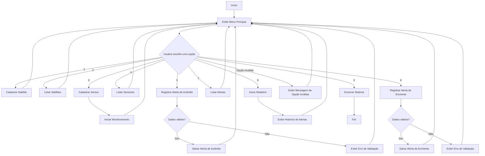

# 🚀 SpaceGuard - Sistema de Monitoramento Ambiental por Satélites

## Integrantes | RMs
* Luan Orlandelli Ramos | 554747
* Arthur Bobadilla Franchi | 555056
* Jorge Luiz Silva Santos | 554418

## 📖 Sobre o Projeto

O **SpaceGuard** é uma aplicação desenvolvida em C# (.NET 8) para auxiliar no monitoramento ambiental utilizando conceitos relacionados à observação terrestre por satélites.

O projeto foi criado como parte da **Global Solution FIAP**, alinhado ao tema da utilização de tecnologias espaciais para monitoramento e prevenção de desastres ambientais.

A solução permite o cadastro de satélites, sensores ambientais e alertas de risco, simulando um sistema capaz de registrar ocorrências de incêndios e enchentes monitoradas por sensores e satélites.

---

# 🎯 Problema

Eventos climáticos extremos, queimadas e enchentes geram impactos ambientais, sociais e econômicos significativos.

Atualmente, sistemas de monitoramento ambiental utilizam sensores e satélites para identificar riscos em tempo real, permitindo ações preventivas antes que os problemas se agravem.

O desafio proposto pela Global Solution consiste em desenvolver uma solução alinhada ao tema espacial, utilizando conceitos de desenvolvimento de software e Programação Orientada a Objetos.

---

# 💡 Solução Proposta

O SpaceGuard simula um sistema de monitoramento ambiental capaz de:

* Cadastrar satélites responsáveis pela observação terrestre;
* Cadastrar sensores ambientais;
* Registrar alertas de incêndios;
* Registrar alertas de enchentes;
* Armazenar histórico de ocorrências;
* Gerar relatórios de monitoramento;
* Validar dados de entrada;
* Tratar erros e exceções de forma segura.

---

# 🏗 Estrutura do Projeto

```text
SpaceGuard
│
├── Abstracts
│   └── EntidadeEspacial.cs
│
├── Interfaces
│   └── IMonitoravel.cs
│
├── Models
│   ├── Satelite.cs
│   ├── Sensor.cs
│   ├── Alerta.cs
│   ├── AlertaIncendio.cs
│   └── AlertaEnchente.cs
│
├── Services
│   └── MonitoramentoService.cs
│
├── Structs
│   └── Coordenada.cs
│
├── Partials
│   ├── Relatorio.cs
│   └── Relatorio.Historico.cs
│
├── Utils
│   └── ConsoleHelper.cs
│
└── Program.cs
```

---

# ⚙ Funcionalidades

### 1. Cadastro de Satélites

Permite registrar satélites utilizados para monitoramento ambiental.

### 2. Cadastro de Sensores

Permite registrar sensores ambientais responsáveis pela coleta de dados.

### 3. Registro de Alertas

O sistema permite registrar:

* Alertas de incêndio;
* Alertas de enchente.

Cada alerta contém:

* Descrição;
* Nível de risco;
* Coordenadas geográficas;
* Data e hora de registro.

### 4. Listagem de Dados

O usuário pode consultar:

* Satélites cadastrados;
* Sensores cadastrados;
* Alertas registrados.

### 5. Relatórios

O sistema gera um resumo contendo:

* Quantidade total de alertas;
* Histórico completo;
* Data e hora de geração.

---

# 🧠 Conceitos de C# Aplicados

## Modelagem de Domínio e Programação Orientada a Objetos

### Classes

Foram utilizadas diversas classes para representar as entidades do domínio:

* Satelite
* Sensor
* Alerta
* AlertaIncendio
* AlertaEnchente
* Relatorio

### Encapsulamento

Os atributos foram protegidos utilizando modificadores de acesso e propriedades controladas.

Exemplo:

```csharp
public string Nome { get; private set; }
```

---

## Herança

A classe Alerta serve como classe base para outros tipos de alerta.

```csharp
public class AlertaIncendio : Alerta
```

```csharp
public class AlertaEnchente : Alerta
```

---

## Polimorfismo

Cada tipo de alerta possui sua própria implementação do método:

```csharp
public override void ExibirDetalhes()
```

Permitindo comportamentos diferentes para incêndios e enchentes.

---

# Abstração

Foi utilizada a classe abstrata:

```csharp
EntidadeEspacial
```

Ela define características comuns das entidades espaciais e obriga as classes filhas a implementarem:

```csharp
ExibirInformacoes()
```

---

# Interfaces

Foi criada a interface:

```csharp
IMonitoravel
```

Responsável por definir o contrato de monitoramento dos sensores.

```csharp
void Monitorar();
```

---

# Injeção de Dependência

A classe:

```csharp
MonitoramentoService
```

recebe objetos através da interface:

```csharp
IMonitoravel
```

reduzindo acoplamento e aumentando a flexibilidade do sistema.

---

# 📅 Manipulação de Datas

O sistema utiliza:

```csharp
DateTime.Now
```

para registrar:

* Data de criação dos alertas;
* Data de geração dos relatórios.

Exemplo:

```csharp
DataRegistro = DateTime.Now;
```

---

# 🔄 Estruturas de Controle e Fluxo

Foram utilizadas:

* while
* switch
* if
* foreach
* try/catch

para controle do fluxo da aplicação.

---

# ⚠ Tratamento de Exceções

O sistema realiza tratamento de erros para evitar encerramentos inesperados.

Exemplos:

### Entrada inválida

```text
Nível de risco: abc
Digite apenas números válidos.
```

### Regra de negócio

```text
Nível de risco: 10
Erro de validação: O nível de risco deve estar entre 1 e 5.
```

---

# 📌 Struct

Foi utilizada a struct:

```csharp
Coordenada
```

para representar:

* Latitude
* Longitude

das ocorrências monitoradas.

---

# 📌 Partial Class

A classe Relatorio foi dividida em dois arquivos:

```text
Relatorio.cs
Relatorio.Historico.cs
```

demonstrando a utilização do recurso Partial Class.

---

# ✅ Atendimento aos Requisitos da Disciplina

| Requisito                                  | Implementação no Projeto                                                                                     |
| ------------------------------------------ | ------------------------------------------------------------------------------------------------------------ |
| Projeto em .NET alinhado à Global Solution | Aplicação Console em C#/.NET 8 com tema de monitoramento ambiental por satélites                             |
| Classes públicas                           | `Satelite`, `Sensor`, `Alerta`, `AlertaIncendio`, `AlertaEnchente`, `Relatorio`                              |
| Encapsulamento                             | Uso de propriedades com `private set`, protegendo alterações diretas nos atributos                           |
| Herança                                    | `AlertaIncendio` e `AlertaEnchente` herdam da classe base `Alerta`                                           |
| Polimorfismo                               | Cada tipo de alerta sobrescreve o método `ExibirDetalhes()`                                                  |
| Classe abstrata                            | `EntidadeEspacial`, utilizada como base conceitual para entidades espaciais                                  |
| Interfaces                                 | `IMonitoravel`, definindo o contrato de monitoramento                                                        |
| Injeção de Dependência                     | `MonitoramentoService` recebe um objeto `IMonitoravel` no construtor                                         |
| Métodos/Funções                            | O `Program.cs` foi modularizado em métodos como `CadastrarSatelite`, `ListarAlertas`, `GerarRelatorio` etc.  |
| Estruturas de controle                     | Uso de `while`, `switch`, `if`, `foreach` e `try/catch`                                                      |
| DateTime                                   | Registro da data/hora dos alertas e da geração dos relatórios                                                |
| Tratamento de Exceções                     | Tratamento de `FormatException`, `ArgumentException` e `Exception`                                           |
| Struct                                     | `Coordenada`, utilizada para representar latitude e longitude                                                |
| Partial Class                              | `Relatorio.cs` e `Relatorio.Historico.cs` dividem a classe `Relatorio`                                       |
| Organização                                | Projeto separado em pastas: `Models`, `Services`, `Interfaces`, `Abstracts`, `Structs`, `Partials` e `Utils` |
| Evidências de execução                     | Foram registradas evidências das principais funcionalidades e dos tratamentos de erro                        |

---

# 🔄 Diagrama de Fluxo




---

# ▶ Como Executar

## Pré-requisitos

* Visual Studio 2022
* .NET 8 SDK

## Passos

1. Abrir a solução no Visual Studio;
2. Compilar o projeto;
3. Executar utilizando:

```text
F5
```

ou

```text
Ctrl + F5
```

---

# 📷 Evidências de Execução

Durante os testes foram validadas as seguintes funcionalidades:

✅ Cadastro de satélites


✅ Listagem de satélites

✅ Cadastro de sensores

✅ Listagem de sensores

✅ Registro de alertas de incêndio

✅ Registro de alertas de enchente

✅ Listagem de alertas

✅ Geração de relatórios

✅ Tratamento de exceções

✅ Encerramento seguro do sistema

---

# 👨‍💻 Tecnologias Utilizadas

* C#
* .NET 8
* Visual Studio 2022

---

# 📚 Projeto Acadêmico

Projeto desenvolvido para a disciplina de **C# Software Development** da FIAP, como parte da **Global Solution**, aplicando conceitos de Programação Orientada a Objetos, abstração, interfaces, injeção de dependência, tratamento de exceções e boas práticas de desenvolvimento.
